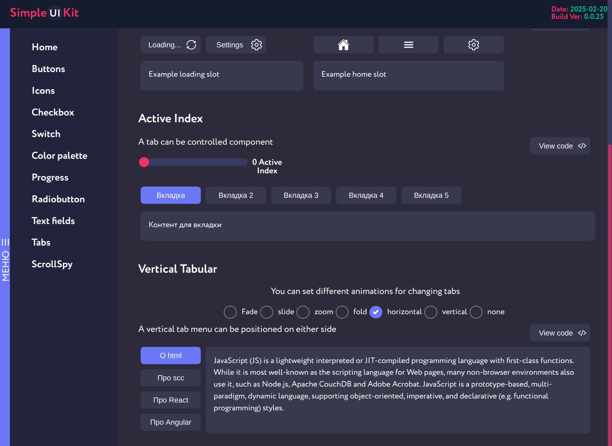

# SimpleUI

A minimalist and lightweight UI library for _**Vue 3**_ built with **_Vite._**

## Description
SimpleUI is a modern component library for Vue 3 that provides a set of basic and commonly used interface elements. The library is designed with a focus on simplicity, performance, and minimalism.




## Demo

Check out the live demo and component examples: [https://simple-ui-dev.vercel.app/](https://simple-ui-dev.vercel.app/)

## Features

- 🚀 Built on Vue 3 and Vite
- 🎨 Customizable components with CSS variables support
- 📦 Modular architecture to import only the components you need 
- 💡 Intuitive API

## Core Components

- **Buttons** - Versatile button components with different sizes, states, and styles
- **Icons** - Comprehensive icon system with customizable sizes and colors
- **Checkbox** - Interactive checkbox components with label support
- **Switch** - Toggle switch components for boolean settings
- **Color palette** - Color system with predefined themes and custom color options
- **Progress** - Progress indicators including bars and spinners
- **Radiobutton** - Radio button group components for single selection
- **Text fields** - Input components for text entry with validation
- **Tabs** - Tabbed interface components with horizontal and vertical orientations


## Installation

```bash
npm install @stasrusnak/simple-ui
```

## Documentation

Detailed documentation and usage examples are available in the [Guide](https://github.com/stasrusnak/simpleUI/tree/main) section.